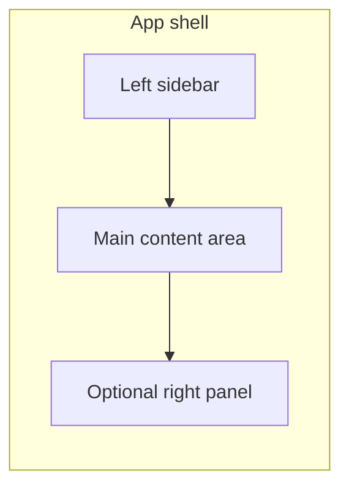
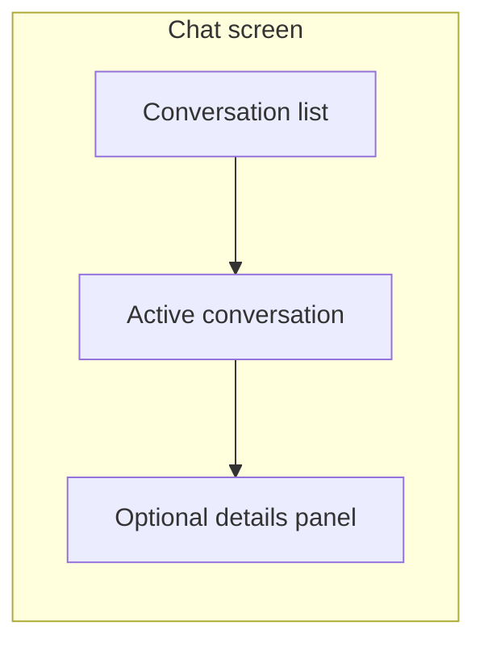

# Chatvioso UI Architecture

Reference for the frontend UI refactor: folder map, page breakdown, component map, and refactor order. Use with [.cursor/rules/chatvioso-ui-rules.mdc](../rules/chatvioso-ui-rules.mdc).

---

## 1. Folder map

### Current structure (under `frontend/`)

| Path | Purpose |
|------|--------|
| `app/` | Next.js App Router: layouts, pages, providers, `globals.css` |
| `app/(auth)/` | Auth route group: login, register, auth layout |
| `app/(app)/` | Authenticated app: layout (AuthGuard + AppShell), app home, workspace/conversation routes |
| `components/` | **Flat**: app-shell, chat header, conversation list/item, message list/bubble/composer, dialogs, panels, `ui/` primitives |
| `hooks/` | Feature hooks: workspaces, conversations, messages, profile, notifications, etc. |
| `lib/` | API/client: `api-client`, `auth`, `utils`, `workspaces`, `conversations`, `messages`, `profile`, `notifications`, `search`, `echo` |
| `stores/` | Zustand: `workspace-store`, `conversation-store` |
| `types/` | API/types (referenced from codebase) |

### Target structure (under `frontend/`)

Keep the Next.js `app/` at `frontend/app/`. Align the rest with the UI rules without introducing a separate `src/` so paths stay `frontend/...`.

| Path | Purpose |
|------|--------|
| `app/` | Unchanged: layouts, providers, route groups, pages |
| `components/ui/` | Small design-system primitives: button, input, label, modal/dialog, avatar, badge, dropdown, tabs, tooltip, confirm-dialog |
| `components/shared/` | App-level composed blocks: app-shell, empty-state, loading-state, error-state, page-header |
| `features/auth/` | Auth feature: components (login form, register form), pages (or thin wrappers), hooks, services, types |
| `features/chats/` | Chats feature: conversation list, list item, sidebar composition; hooks; services; types |
| `features/messages/` | Messages feature: message list, message bubble, composer, attachments; hooks; services; types |
| `features/contacts/` | Contacts/people (if applicable): components, hooks, services |
| `features/settings/` | Profile + workspace settings: components, pages, hooks, services |
| `lib/` | Unchanged: utils, constants, api-client, auth, feature API modules |
| `styles/` | Optional: `globals.css`, `tokens.css` (or keep under `app/`) |
| `hooks/` | Can remain at root for cross-feature hooks or move into features |

**Clarification:** Target is **under `frontend/`** (e.g. `frontend/components/ui/`, `frontend/features/chats/`). No `frontend/src/` migration required unless you decide to consolidate all app code under `frontend/src/` later.

---

## 2. Layout diagrams

### App shell (current and target)

- **Left sidebar:** Logo, notifications, search, workspace switcher, conversation list, create actions (workspace, DM, group, channel), nav links (Home, Profile, Workspace, Members, Invitations), user/profile, logout.
- **Main:** Page content (home, conversation view, settings, members, etc.).
- **Right (optional):** Shared files panel, pinned messages panel, or conversation/user details.

### Chat screen layout

- **Left:** Conversation list (sidebar or dedicated column).
- **Center:** Active conversation: header + message list + composer.
- **Right (optional):** User/chat details, attachments, or pinned messages.

---

## 3. Page breakdown

| Route | Purpose | Main components | Layout |
|-------|---------|------------------|--------|
| `/` | Root redirect/landing | — | — |
| `/login` | Sign in | Auth layout, login form | Centered card |
| `/register` | Sign up | Auth layout, register form | Centered card |
| `/app` | App home | AppShell, welcome + workspace links | Shell: sidebar + main |
| `/app/profile` | User profile | AppShell, profile form/display | Shell: sidebar + main |
| `/app/workspaces/[id]/settings` | Workspace settings | AppShell, settings form | Shell: sidebar + main |
| `/app/workspaces/[id]/members` | Workspace members | AppShell, members list | Shell: sidebar + main |
| `/app/workspaces/[id]/invitations` | Invitations | AppShell, invitations list | Shell: sidebar + main |
| `/app/workspaces/[id]/search` | Workspace search | AppShell, search form + results | Shell: sidebar + main |
| `/app/workspaces/[id]/conversations/[convId]` | Conversation view | AppShell, ChatHeader, MessageList, MessageComposer, panels | Shell: sidebar + list + center (conv) + optional right |

Each page must have: clear purpose, loading state, empty state, and error state where data-driven.

---

## 4. Component map

### UI (design-system primitives)

| Component | Current path | Target path | Notes |
|-----------|--------------|-------------|--------|
| Button | `components/ui/button.tsx` | `components/ui/button/` or keep single file | Variants: primary, secondary, ghost, outline, destructive, icon-only |
| Input | `components/ui/input.tsx` | `components/ui/input/` or keep | With label, error, validation |
| Label | `components/ui/label.tsx` | `components/ui/label/` or keep | Accessible labels |
| ConfirmDialog | `components/ui/confirm-dialog.tsx` | `components/ui/modal/` or `confirm-dialog/` | Reusable confirmation modal |
| EmptyState | `components/ui/empty-state.tsx` | `components/shared/empty-state/` | Shared block |
| LoadingState | `components/ui/loading-state.tsx` | `components/shared/loading/` | Shared block |
| ErrorState | `components/ui/error-state.tsx` | `components/shared/error-state/` or keep under ui | Shared block |
| Modal | — | `components/ui/modal/` | Add if not covered by confirm-dialog |
| Avatar | — | `components/ui/avatar/` | Add: sizes, initials fallback |
| Badge | — | `components/ui/badge/` | Add: variants (e.g. unread) |
| Dropdown | — | `components/ui/dropdown/` | Add for menus |
| Tabs | — | `components/ui/tabs/` | Add if needed |
| Tooltip | — | `components/ui/tooltip/` | Add if needed |

### Shared (app-level composed)

| Component | Current path | Target path | Notes |
|-----------|--------------|-------------|--------|
| AppShell | `components/app-shell.tsx` | `components/shared/app-shell/` | Sidebar + main + optional right |
| EmptyState | `components/ui/empty-state.tsx` | `components/shared/empty-state/` | — |
| LoadingState | `components/ui/loading-state.tsx` | `components/shared/loading/` | — |
| ErrorState | `components/ui/error-state.tsx` | `components/shared/` | — |
| PageHeader | — | `components/shared/page-header/` | Optional shared page title/actions |

### Feature: auth

| Component | Current path | Target path |
|-----------|--------------|-------------|
| Auth layout | `app/(auth)/layout.tsx` | Keep in app |
| Login page | `app/(auth)/login/page.tsx` | Keep in app; use `features/auth` form component |
| Register page | `app/(auth)/register/page.tsx` | Keep in app; use `features/auth` form component |
| AuthGuard | `components/auth-guard.tsx` | `features/auth/components/auth-guard.tsx` |

### Feature: chats (conversations / sidebar)

| Component | Current path | Target path |
|-----------|--------------|-------------|
| ConversationList | `components/conversation-list.tsx` | `features/chats/components/conversation-list.tsx` |
| ConversationListItem | `components/conversation-list-item.tsx` | `features/chats/components/conversation-list-item.tsx` |
| WorkspaceSwitcher | `components/workspace-switcher.tsx` | `features/chats/components/workspace-switcher.tsx` or shared |
| CreateWorkspaceDialog | `components/create-workspace-dialog.tsx` | `features/chats/components/create-workspace-dialog.tsx` or settings |
| CreateDirectMessageDialog | `components/create-direct-message-dialog.tsx` | `features/chats/components/create-direct-message-dialog.tsx` |
| CreateGroupConversationDialog | `components/create-group-conversation-dialog.tsx` | `features/chats/components/create-group-conversation-dialog.tsx` |
| CreateChannelDialog | `components/create-channel-dialog.tsx` | `features/chats/components/create-channel-dialog.tsx` |
| SearchForm | `components/search-form.tsx` | `features/chats/components/search-form.tsx` or shared |

### Feature: messages

| Component | Current path | Target path |
|-----------|--------------|-------------|
| ChatHeader | `components/chat-header.tsx` | `features/messages/components/chat-header.tsx` or `conversation-header.tsx` |
| MessageList | `components/message-list.tsx` | `features/messages/components/message-list.tsx` |
| MessageBubble | `components/message-bubble.tsx` | `features/messages/components/message-bubble.tsx` |
| MessageComposer | `components/message-composer.tsx` | `features/messages/components/message-composer.tsx` |
| MessageAttachments | `components/message-attachments.tsx` | `features/messages/components/message-attachments.tsx` |
| PinnedMessagesPanel | `components/pinned-messages-panel.tsx` | `features/messages/components/pinned-messages-panel.tsx` |
| SharedFilesPanel | `components/shared-files-panel.tsx` | `features/messages/components/shared-files-panel.tsx` |

### Feature: settings / profile

| Component | Current path | Target path |
|-----------|--------------|-------------|
| (Profile page) | `app/(app)/app/profile/page.tsx` | Keep in app; use `features/settings` or `features/profile` components |
| (Workspace settings, members, invitations) | `app/(app)/app/workspaces/[id]/...` | Keep in app; use feature components |

### Other

| Component | Current path | Target path |
|-----------|--------------|-------------|
| NotificationBell | `components/notification-bell.tsx` | `features/notifications/` or `components/shared/` |

---

## 5. Refactor order

Follow this sequence so dependencies and layout stay consistent.

1. **Design tokens and globals**
   - Add or refine `frontend/app/globals.css` (and optional `frontend/styles/tokens.css`).
   - Define spacing, typography, radius, shadow, color roles (see UI rules §4).

2. **`components/ui` primitives**
   - Button, Input, Label (already exist; align with design system).
   - Add or extract: Avatar, Badge, Modal/Dialog, Dropdown, Tabs, Tooltip as needed.
   - ConfirmDialog: keep or move into modal system.

3. **`components/shared`**
   - EmptyState, LoadingState, ErrorState: move or duplicate into `components/shared/` and use consistently.
   - Add PageHeader if useful.
   - Prepare AppShell for move to `components/shared/app-shell/` (or keep path and refactor in place).

4. **App shell and layout**
   - Refactor AppShell: clear sidebar / main / optional right; responsive behavior; consistent nav and actions.
   - Ensure layout handles height (sidebar scroll, main scroll, fixed header/composer).

5. **Auth pages**
   - Login and register: use design system and shared components; optional `features/auth` form components.
   - AuthGuard: styling and placement.

6. **Chat list and conversation area**
   - ConversationList and ConversationListItem: align with UI rules (avatar, name, preview, time, unread, active).
   - Conversation page layout: header + message list + composer; optional right panel (files, pinned).

7. **Composer and messages**
   - MessageBubble, MessageList, MessageComposer: align with UI rules (grouping, timestamps, attachments, focus, send).
   - Loading/skeleton for message panel and list.

8. **Profile and settings pages**
   - Profile, workspace settings, members, invitations, search: shared layout and components; loading/empty/error states.

9. **Empty, loading, error states and polish**
   - No chat selected, no messages, no search results, no contacts: intentional empty states with message and optional CTA.
   - Skeleton/loading for list, message panel, profile.
   - Motion: subtle only (fade, slide, shimmer).
   - Accessibility and keyboard pass.

---

## 6. Summary

- **Current:** Flat `frontend/components/`, `frontend/app/`, `frontend/hooks/`, `frontend/lib/`, `frontend/stores/`.
- **Target:** Same root; add `components/ui/` and `components/shared/`; add `features/auth`, `features/chats`, `features/messages`, `features/contacts`, `features/settings` with components/hooks/services as needed.
- **Pages:** Auth, app home, profile, workspace settings/members/invitations, search, conversation view—each with clear layout and states.
- **Refactor order:** Tokens → UI primitives → shared → shell → auth → chat list & conversation → composer & messages → settings & profile → empty/loading/error and polish.

Use this doc together with the UI rules so every screen and component stays consistent during the rebuild.
